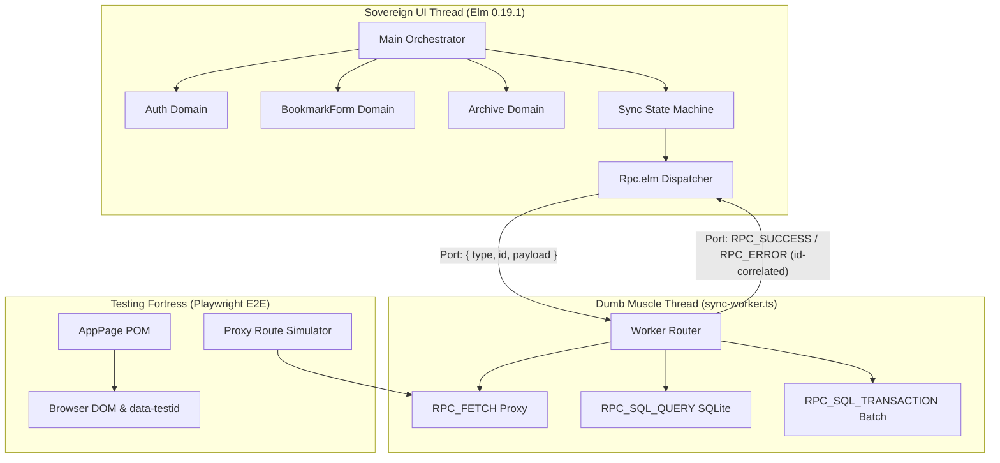

# Pingolin Federated Domain Architecture

## 1. The Sovereign Law
Structure large Elm SPA applications by partitioning state around cohesive domain models (`Auth`, `Archive`, `BookmarkForm`, `Sync`) rather than visual UI components or a monolithic flat `Main.Model`, routing messages through the parent orchestrator via the `updateWith` delegation pattern.

## 2. The Trigger & Context
As an Elm application expands, developers face two opposing architectural traps:
- **The Flat "God Model" Monolith:** Keeping all 60 application state fields, 80 `Msg` variants, and 2,000 lines of update logic inside a single `Main.elm`. While it avoids boilerplate, it becomes mentally exhausting to navigate.
- **The React Component-itis Trap:** Splitting every button, sidebar, and dropdown into its own isolated TEA module, causing a nightmare of nested message wrappers (`DropdownMsg SubDropdownMsg (GotItem String)`).
- **The Sovereign Domain Compromise:** Grouping state into **3-4 major Domain Modules** centered around core business custom types (`Auth.Model`, `Archive.Model`, `BookmarkForm.Model`), while view components remain stateless pure functions.



---

## 3. Developer Intent vs. Elm Semantics

| Dimension | Monolithic Flat Model (`Main.elm`) | Component Hierarchy (React style) | Federated Domain Architecture (Pingolin) |
| :--- | :--- | :--- | :--- |
| **Module Partitioning** | None (Single massive file). | Visual widgets (Sidebar, Header, Card). | **Domain Boundaries:** Grouped around core business types (`Auth`, `Archive`, `BookmarkForm`). |
| **State Organization** | 60+ fields in one flat record. | Fragmented local states in child objects. | Subdivided domain models nested inside `Main.Model`. |
| **Message Routing** | Handled in one giant `case msg of`. | Complex multi-tier forwarding glue. | Delegated via clean `updateWith` pattern to domain update functions. |
| **Refactoring Safety** | High risk of name collision. | Complex state sync issues. | Perfect encapsulation with clear data boundaries. |

---

## 4. The Pattern: The `updateWith` Delegation Pattern

### 1. The Orchestrator (`Main.elm`)

```elm
module Main exposing (Model, Msg(..), init, update, view)

import Archive
import Auth
import BookmarkForm
import Html exposing (Html, div)
import Sync

type alias Model =
    { auth : Auth.Model
    , archive : Archive.Model
    , form : BookmarkForm.Model
    , sync : Sync.Model
    }

type Msg
    = GotAuthMsg Auth.Msg
    | GotArchiveMsg Archive.Msg
    | GotFormMsg BookmarkForm.Msg
    | GotSyncMsg Sync.Msg

update : Msg -> Model -> ( Model, Cmd Msg )
update msg model =
    case msg of
        GotAuthMsg authMsg ->
            updateWith (\subModel -> { model | auth = subModel }) GotAuthMsg (Auth.update authMsg model.auth)

        GotArchiveMsg archiveMsg ->
            updateWith (\subModel -> { model | archive = subModel }) GotArchiveMsg (Archive.update archiveMsg model.archive)

        GotFormMsg formMsg ->
            updateWith (\subModel -> { model | form = subModel }) GotFormMsg (BookmarkForm.update formMsg model.form)

        GotSyncMsg syncMsg ->
            updateWith (\subModel -> { model | sync = subModel }) GotSyncMsg (Sync.update syncMsg model.sync)

{-| Standard helper for lifting domain updates into the top-level orchestrator.
-}
updateWith : (subModel -> Model) -> (subMsg -> Msg) -> ( subModel, Cmd subMsg ) -> ( Model, Cmd Msg )
updateWith toModel toMsg ( subModel, subCmd ) =
    ( toModel subModel
    , Cmd.map toMsg subCmd
    )

view : Model -> Html Msg
view model =
    div []
        [ Html.map GotAuthMsg (Auth.view model.auth)
        , Html.map GotFormMsg (BookmarkForm.view model.form)
        , Html.map GotArchiveMsg (Archive.view model.archive)
        ]
```

### 2. The Knowledge Domain Module (`Archive.elm`)

```elm
module Archive exposing (Model, Msg(..), init, update, view)

import Html exposing (Html, div, input, text)
import Html.Attributes exposing (placeholder, value)
import Html.Events exposing (onInput)
import Types exposing (Bookmark)

type alias Model =
    { query : String
    , bookmarks : List Bookmark
    , filteredCount : Int
    }

type Msg
    = SearchQueryChanged String
    | BookmarksLoaded (List Bookmark)

init : ( Model, Cmd Msg )
init =
    ( { query = ""
      , bookmarks = []
      , filteredCount = 0
      }
    , Cmd.none
    )

update : Msg -> Model -> ( Model, Cmd Msg )
update msg model =
    case msg of
        SearchQueryChanged newQuery ->
            ( { model | query = newQuery }, Cmd.none )

        BookmarksLoaded items ->
            ( { model | bookmarks = items, filteredCount = List.length items }, Cmd.none )

view : Model -> Html Msg
view model =
    div []
        [ input [ placeholder "Search bookmarks...", value model.query, onInput SearchQueryChanged ] []
        , text ("Showing " ++ String.fromInt model.filteredCount ++ " bookmarks")
        ]
```
