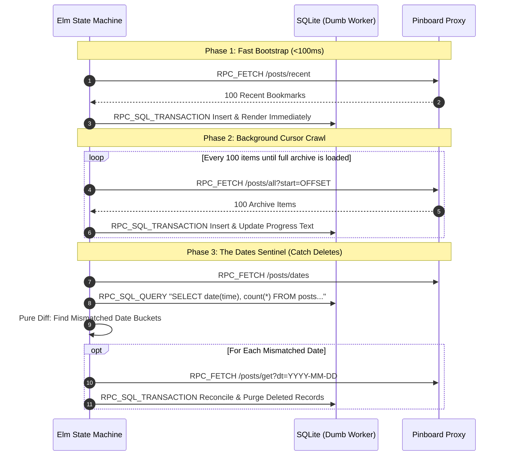

# Pingolin Sync V2: High-Density Eventual Consistency Engine

## 1. The Sovereign Law
To sync 22,000+ bookmarks with instantaneous UI responsiveness and zero data loss, divide synchronization into a 3-stage pipeline: **1. Fast Bootstrap** (`/posts/recent` unblocking the viewport in <100ms), **2. Background Cursor Crawl** (batch-inserting archive pages into SQLite), and **3. The Dates Sentinel Hack** (comparing remote `/posts/dates` against local date distributions to resolve drift and purge deleted bookmarks).

## 2. The Trigger & Context
Standard naive REST synchronization fails catastrophically at scale (20,000+ bookmarks):
- **The Initial Load Freeze:** Attempting to download the entire archive (`/posts/all`) on first app boot causes multi-minute blank screens and mobile browser memory crashes.
- **Pagination Drift:** New bookmarks created during a background crawl shift page offsets, causing duplicate entries or missed bookmarks.
- **The Pinboard Deletion Blindness:** The Pinboard API does not provide a deleted posts stream. An app syncing incrementally has no way of knowing a bookmark was deleted upstream unless it downloads the entire database again or checks every date bucket.

---

## 3. Developer Intent vs. Elm Semantics

| Dimension | Naive Single-Pass Sync | Pingolin Sync V2 Architecture |
| :--- | :--- | :--- |
| **First Render** | Block UI until all 22,000 records are fetched and parsed. | **Instant Fast Path:** Fetch 100 `/posts/recent`, render UI in <100ms, and transition to background mode. |
| **Hydration Strategy** | Huge single JSON payload causing memory spikes. | **Batched Cursor Crawl:** Iterative 100-item pages inserted via atomic SQLite transactions (`BEGIN; ... COMMIT;`). |
| **Detecting Deletions** | Impossible without redownloading all 20k posts. | **The Dates Sentinel:** Fetch lightweight `/posts/dates` histogram ($< 5\text{KB}$); query local SQLite date counts; re-fetch *only* mismatched days. |
| **API Throttling** | Rapid-fire requests triggering Pinboard HTTP 429 rate limits. | State Machine enforces explicit `Process.sleep 3000` delays between flush mutations. |

---

## 4. The Pattern

### The 3-Phase Sync Pipeline



---

### Elm State Machine Implementation (`Sync.elm`)

```elm
module Sync exposing (SyncPhase(..), SyncEnv, stepSync)

import Time exposing (Posix)

type SyncPhase
    = Idle
    | FastBootstrapStarting
    | HydratingArchive { currentOffset : Int, totalEstimated : Int }
    | RunningDatesReconciliation
    | ReconcilingDay { date : String, remainingDates : List String }
    | FlushingPendingQueue { pendingCount : Int, currentIndex : Int }
    | SyncFailed String

type alias SyncEnv =
    { proxyUrl : String
    , authToken : String
    , lastFullSyncTime : Maybe Posix
    }

-- Pure state transition function driving the entire sync lifecycle
stepSync : SyncPhase -> Msg -> ( SyncPhase, Cmd Msg )
stepSync phase msg =
    case ( phase, msg ) of
        ( Idle, TriggerSync ) ->
            ( FastBootstrapStarting, fetchRecentBookmarksCmd )

        ( FastBootstrapStarting, RecentBookmarksReceived bookmarks ) ->
            ( HydratingArchive { currentOffset = 100, totalEstimated = 22000 }
            , Cmd.batch [ renderBookmarksCmd bookmarks, fetchNextArchivePageCmd 100 ]
            )

        ( HydratingArchive status, ArchivePageReceived pageData ) ->
            if List.isEmpty pageData.items then
                -- Hydration complete -> Advance to Dates Sentinel
                ( RunningDatesReconciliation, fetchRemoteDatesCmd )

            else
                let
                    nextOffset = status.currentOffset + List.length pageData.items
                in
                ( HydratingArchive { status | currentOffset = nextOffset }
                , fetchNextArchivePageCmd nextOffset
                )

        ( RunningDatesReconciliation, DatesCompared mismatchedDates ) ->
            case mismatchedDates of
                [] ->
                    -- Perfect parity! Record handshake sentinel
                    ( Idle, recordSyncHandshakeCmd )

                firstDay :: rest ->
                    ( ReconcilingDay { date = firstDay, remainingDates = rest }
                    , fetchDayBookmarksCmd firstDay
                    )

        _ ->
            ( phase, Cmd.none )
```
