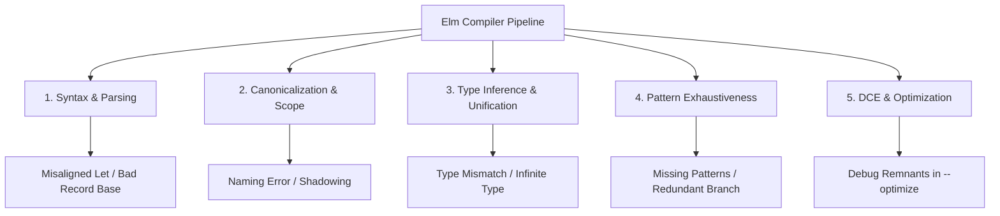

# Compiler Error Taxonomy & Recovery Catalog

## 1. The Sovereign Law
Elm compiler diagnostics are partitioned into distinct diagnostic families across the compilation pipeline (Parsing, Canonicalization, Type Inference, Pattern Exhaustiveness, and Optimization). Identifying the underlying failure category immediately yields the exact structural refactoring required.

## 2. The Five Diagnostic Families (Distilled from 300 Error Catalog Issues)

Based on the 300 real-world developer failure modes cataloged in `wiki/raw/error-catalog/issues/`, Elm errors fall into five primary categories:



---

## 3. Top Recurring Error Patterns & Canonical Solutions

### Pattern 1: `INFINITE TYPE` (Occurrences: Issues #102, #146, #212, #317)
- **The Trigger:** Defining a self-referential type alias or passing a function to itself without wrapping it in a nominal `type` constructor.
- **Compiler Diagnostic:** *"I am inferring a weird self-referential type for this variable... You may need a custom type to define a recursive structure."*

#### ❌ WRONG (Self-Referential Type Alias)
```elm
-- FAILS: Type aliases cannot be recursive!
type alias Tree =
    { value : String
    , children : List Tree -- Infinite expansion during type checking
    }
```

#### ✅ RIGHT (Nominal Custom Type Wrapping)
```elm
-- SUCCESS: Custom types introduce nominal indirection, allowing recursive structures
type Tree
    = Node String (List Tree)
```

---

### Pattern 2: `BAD RECORD UPDATE` (Occurrences: Issues #068, #081, #120, #259)
- **The Trigger:** Attempting to update a qualified variable (`Module.record`) or nested expression (`model.user`) as the base of `{ ... | field = val }`.
- **Compiler Diagnostic:** *"The base of a record update must be a simple variable name."*

#### ❌ WRONG (Qualified / Nested Base)
```elm
updateUserBad : Model -> Model
updateUserBad model =
    { model.user | name = "Alice" } -- FAILS: base is model.user
```

#### ✅ RIGHT (Unpack to Local Variable)
```elm
updateUserGood : Model -> Model
updateUserGood model =
    let
        user = model.user
        updatedUser = { user | name = "Alice" }
    in
    { model | user = updatedUser }
```

---

### Pattern 3: `MISSING PATTERNS` (Occurrences: Issues #072, #136, #189, #284)
- **The Trigger:** Incomplete pattern match in `case ... of` after adding a new variant to a custom type.
- **Compiler Diagnostic:** *"This `case` does not have branches for all possibilities! Missing cases: ... I would have to crash if I saw one of those."*

#### ❌ WRONG (Wildcard Catch-All Hiding Bugs)
```elm
handleStatusBad : Status -> String
handleStatusBad status =
    case status of
        Active -> "Active"
        _ -> "Other" -- DANGEROUS: New variants added in the future silently hit wildcard!
```

#### ✅ RIGHT (Exhaustive Explicit Matches)
```elm
handleStatusGood : Status -> String
handleStatusGood status =
    case status of
        Active -> "Active"
        Suspended -> "Suspended"
        Archived -> "Archived" -- Explicit handling required when variants change
```

---

### Pattern 4: `PRECEDENCE / ARGUMENT MISMATCH` (Occurrences: Issues #085, #165, #232, #345)
- **The Trigger:** Function application binds tighter than infix operators or forgetting parentheses around sub-expressions.
- **Compiler Diagnostic:** *"The 1st argument to `func` is not what I expect."*

#### ❌ WRONG (Infix & Function Application Precedence)
```elm
formatNameBad : String -> String
formatNameBad name =
    -- Parsed as: (String.trim) (name ++ "!") -> TYPE MISMATCH!
    String.trim name ++ "!"
```

#### ✅ RIGHT (Explicit Parentheses or Pipelines)
```elm
formatNameGood : String -> String
formatNameGood name =
    String.trim (name ++ "!")

formatNamePiped : String -> String
formatNamePiped name =
    (name ++ "!")
        |> String.trim
```

---

## 4. The Diagnostic Matrix

| Diagnostic Title | Pipeline Stage | Primary Root Cause | Canonical Remedy |
| :--- | :--- | :--- | :--- |
| `SYNTAX PROBLEM` | Parser | Misaligned indentation in `let...in` or invalid tokens. | Align definitions vertically to matching column. |
| `NAMING ERROR` | Canonicalize | Typo in variable name or forgotten module import. | Inspect Levenshtein suggestion or add `import Module exposing (...)`. |
| `TYPE MISMATCH` | Type Checker | Function argument or branch expression yields unexpected type. | Inspect expected vs actual diff; check function arity. |
| `INFINITE TYPE` | Type Checker | Recursive type alias or self-referential lambda. | Wrap in nominal `type` (Custom Type). |
| `MISSING PATTERNS` | Exhaustiveness | Unhandled custom type variant in `case...of`. | Add explicit branches for all listed variants. |
| `DEBUG REMNANTS` | Optimizer | `Debug.log` / `Debug.todo` called with `--optimize`. | Remove all `Debug.*` calls before production build. |
