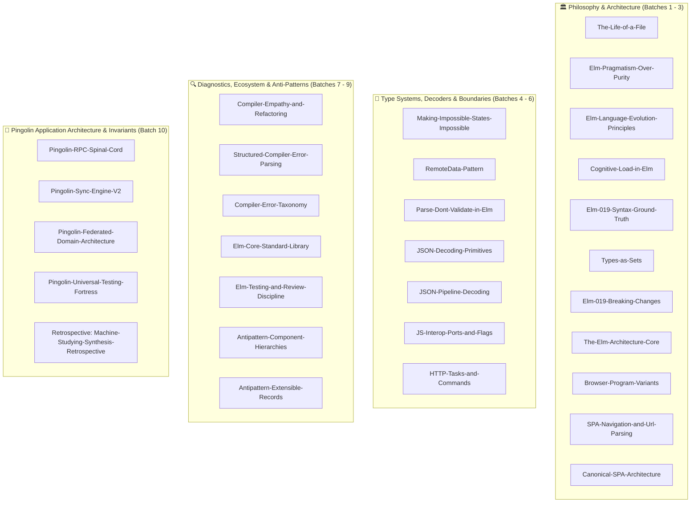

# Pinboard Reorg Wiki Index

## 📚 Sources & Curriculum
- [[raw/sources]] - Master curriculum manifest and source ingestion tracker.
- [[raw/llm-wiki]] - Architecture and operating principles for persistent LLM knowledge bases.
- [[raw/machine-studying]] - Theory of token minimization and autonomous machine expertise.
- [[raw/recursive-language-models]] - Mechanics of recursive agent loops and grimoire creation.
- [[raw/the-great-collapse]] - Historical post-mortem of catastrophic state loss and recovery.
- [[log]] - Chronological append-only timeline of knowledge base milestones.

## 🏛️ Philosophical Pillars
- [[The-Gospel-of-Glorious-Struggles]] - On the necessity of friction and the beauty of the struggle.
- [[The-Life-of-a-File]] - Grow files organically; split modules around invariant data, not components.
- [[Elm-Pragmatism-Over-Purity]] - Simpler foundations produce simpler code, prioritizing human accessibility over purity.
- [[Elm-Language-Evolution-Principles]] - Deliberate API distillation ensures long-term ecosystem stability over rapid churn.
- [[Cognitive-Load-in-Elm]] - Minimize cognitive load through explicit, readable flows rather than clever abstractions.

## ⚙️ Technical Laws & Architecture
- [[Antipattern-Component-Hierarchies]] - Avoid nested stateful component architectures; maintain flat state and pure views.
- [[Antipattern-Extensible-Records]] - Avoid extensible record overuse; use concrete models and explicit field helpers.
- [[Elm-Core-Standard-Library]] - Total collection operations, comparable Dict keys, and O(1) list disciplines.
- [[Elm-Testing-and-Review-Discipline]] - Property-based fuzz testing and compile-time AST rule enforcement via elm-review.
- [[Compiler-Empathy-and-Refactoring]] - Compiler diagnostics as actionable refactoring guides for fearless changes.
- [[Structured-Compiler-Error-Parsing]] - Machine-readable JSON diagnostic parsing for automated agent self-correction.
- [[concepts/Compiler-Error-Taxonomy]] - The 5 diagnostic families and recovery patterns from 300 catalog issues.
- [[JS-Interop-Ports-and-Flags]] - Resilient Value flags, asynchronous ports, and Web Component custom elements.
- [[HTTP-Tasks-and-Commands]] - Declarative Http.expectJson, exhaustive Http.Error handling, and Task composition.
- [[JSON-Decoding-Primitives]] - Explicit decoupled decoders and encoders with structural error reporting.
- [[JSON-Pipeline-Decoding]] - Arbitrary record decoding and dependent andThen validation pipelines.
- [[Making-Impossible-States-Impossible]] - Encode invariants into data structures to eliminate invalid states at compile time.
- [[RemoteData-Pattern]] - Model async data lifecycles as a four-state disjoint union.
- [[Parse-Dont-Validate-in-Elm]] - Transform untrusted data into verified opaque domain types at boundaries.
- [[The-Elm-Architecture-Core]] - Model-Update-View loop with pure message dispatch and managed commands.
- [[Browser-Program-Variants]] - Capabilities and topologies of sandbox, element, document, and application.
- [[SPA-Navigation-and-Url-Parsing]] - UrlRequest interception, Navigation.Key safety, and Url.Parser combinators.
- [[Canonical-SPA-Architecture]] - Production SPA structure: page module delegation with shared session.
- [[Elm-019-Syntax-Ground-Truth]] - Pure expressions, curried functions, simple record updates, and exhaustive patterns.
- [[Types-as-Sets]] - Custom types create disjoint sets, making invalid domain states impossible.
- [[Elm-019-Breaking-Changes]] - Elimination of toString, package migration to elm/*, and DCE invariants.
- [[Elm-Sovereign-Laws]] - Syntactic constraints and compiler interpretation.
- [[Elm-Where-Clauses]] - Parser rule for let bindings and the ghost server test pitfall.
- [[Elm-Named-Records]] - Named types are mandatory for nested record updates.
- [[State-Flow-Pinboard]] - The pipeline from Worker to Model.
- [[Sovereign-Domain-Migration]] - The shift from flat to federated state in the PWA.
- [[concepts/Monolith-Decomposition-Rules]] - How to cleanly split a monolithic Elm module.
- [[Tag-Alias-Paradox]] - Aliases bypass for #tag explicit queries.
- [[UI-Pending-Delete-Filter]] - Filter PendingDelete items from the UI.
- [[Session-Restore-Fallback]] - Priority chain for restored lastSync time.
- [[Elm-Worker-Chain-Msg]] - Use Msg chaining for worker-driven sequences.
- [[Search-Persistence]] - Preserve active search query after sync refresh.
- [[Session-Restore-Amnesia]] - Guard lastSyncTime during restoration via transient phase.
- [[Sovereign-Domain-View]] - Delegate complex rendering to domain modules.
- [[Functional-Parity]] - Why compiled $\neq$ correct in federated models.
- [[Catastrophic-Restoration]] - When to stop editing and start restoring.

## 🪞 Reflections & Debriefs
- [[reflections/Machine-Studying-Synthesis-Retrospective]] - Theoretical synthesis of Machine Studying, LLM Wiki, and future horizons.
- [[reflections/Option-B-Easy-Mode-Debrief]] - Honest post-mortem: what was cheated, what was learned, Hard Mode protocol.

## 🛠️ Rituals & RUDs (Project Specific)
- [[Pingolin-RPC-Spinal-Cord]] - Dumb muscle worker, correlated request IDs, and Elm Sovereign General.
- [[Pingolin-Sync-Engine-V2]] - Fast bootstrap, background cursor crawl, and QLPIG Dates reconciliation sentinel.
- [[Pingolin-Federated-Domain-Architecture]] - Modular state ownership across Auth, Archive, BookmarkForm, and Sync.
- [[Pingolin-Universal-Testing-Fortress]] - Language-agnostic black-box E2E testing with Page Object Models.
- [[Fixing-State-Loss-in-Federated-Models]] - How to properly integrate worker responses into nested domain models.
- [[tools/Hard-Won-Wisdom]] - Shell scripting word-splitting, recursive backups, and test ghosting.
- [[Verification-Rituals]] - The discipline of the single-test run.
- [[concepts/The-Compiler-as-Sovereign-Pirate]] - Ruthless benevolence, zero runtime crashes, and empathetic refactoring guidance.
- [[concepts/Sync-State-Machine]] - The "General" of the app: SyncEnv and SyncPhase.
