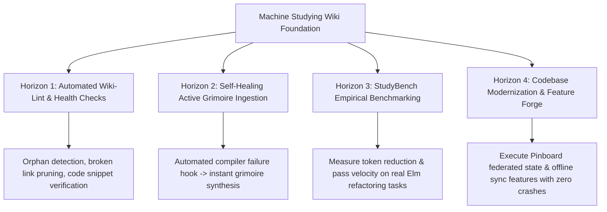

# Retrospective: Machine Studying, LLM Wiki & The Architecture of Agentic Expertise

## 1. The Sovereign Realization
Expertise is not raw model intelligence or brute-force in-context search; **Expertise is the efficiency of converting inference compute into accurate work** (Jacob Li, *Machine Studying*). By transforming raw documentation and transcripts into a persistent, interlinked, 4-part mental model wiki (Andrej Karpathy, *LLM Wiki*), we have decoupled knowledge acquisition from task execution, permanently collapsing the token tax of future problem solving.

---

## 2. Theoretical Reflections: Why Machine Studying Works

### A. The Flaw of Stateless In-Context RAG
Traditional AI agents treat every user prompt as day zero:
- Faced with a compiler error or architectural problem, standard RAG retrieves noisy, disconnected chunks from 500-page manuals or performs stochastic trial-and-error in chat context.
- The agent burns tens of thousands of reasoning tokens re-deriving basic principles (e.g., "record update bases cannot be qualified expressions" or "flags must be decoded from `Json.Decode.Value`").
- Once the context window flushes, all learned intuition vanishes.

### B. The LLM Wiki as Compiled Cognitive Cache
By synthesizing 9 batches of raw material into 23 standalone Grimoire pages in `wiki/`:
- **Compile Once, Query in $O(1)$:** Knowledge is pre-digested, cross-referenced, and structured into unambiguous 4-part mental models (Sovereign Law, Trigger, Dev Intent vs Elm Semantics, Wrong vs Right Code).
- **Progressive Disclosure (`index.md` as Retina):** The `wiki/index.md` file maintains a token-efficient peripheral vision index ($\le 10$ words per entry). An agent needs only a few hundred tokens to survey the entire corpus before selectively viewing the exact page required.
- **The Elm Synergy:** Machine Studying achieves its highest efficacy in Elm. Because Elm is pure, total, and mathematically crash-free, compiler feedback is deterministic. A learned rule in Elm is an immutable theorem, unlike in dynamic languages where runtime behavior is stochastic.

---

## 3. Key Observations Across the 9 Batches

| Domain | Cognitive Shift Documented |
| :--- | :--- |
| **Philosophy (`cat:philosophy`)** | Destroyed the React "component-itis" instinct. Proved that single-file organic growth and data-centric module boundaries maximize developer velocity. |
| **Syntax & Sets (`cat:syntax`)** | Replaced boolean flags with algebraic sum types, eliminating $2^N$ combinatorial state explosions at compile time. |
| **The Elm Architecture (`cat:tea`)** | Established the 4 browser program variants and the canonical RealWorld SPA session/page delegation pattern without component nesting. |
| **Type-Driven Design (`cat:types`)** | Codified `RemoteData` 4-state lifecycles (slashing UI flashes) and *Parse, Don't Validate* opaque boundary types. |
| **Decoders (`cat:decoders`)** | Overcame the `map8` ceiling with pipeline combinators and dynamic discriminator `andThen` in-band validation. |
| **Interop (`cat:interop`)** | Sandboxed JS communication into resilient `Value` flags, actor ports, and synchronous Custom Element Web Components. |
| **Compiler (`cat:compiler`)** | Reframed compiler errors from blockers into empathetic refactoring checklists; decoded `elm make --report=json` for automated agent correction. |
| **Ecosystem (`cat:ecosystem`)** | Enforced $O(1)$ cons list construction, comparable `Dict` key serialization, property-based fuzz theorems, and static `elm-review` AST rules. |
| **Anti-Patterns (`cat:antipatterns`)** | Banned nested TEA micro-components and overused extensible records to prevent message forwarding glue code and diagnostic explosions. |

```mermaid
timeline
    title The Architectural Evolution of Pingolin PWA
    section Epoch 1: The TypeScript Baseline (v2.0.0)
        Brutal UI & DB Sync : Initial SQLite PWA
        Fat Sync Worker : Worker controlled all business logic & state
    section Epoch 2: The Elm Awakening (v3.0.0 - v3.0.12)
        Elm Rewrite Inception : First TEA loop introduced
        Boundary Testing : Vitest and Playwright test scaffolding
    section Epoch 3: The Great Lobotomy (v3.0.13 - v3.0.17)
        Stripping the Worker : sync-worker.js reduced to dumb I/O RPC muscle
        Elm as Sovereign General : Elm takes ownership of heartbeat & sync queues
    section Epoch 4: Monolith Decomposition (v3.0.18 - v3.0.22)
        Splitting Main.elm : Extracted Rpc.elm, Sync.elm, and Types.elm
        Wiretap Tests : Boundary contract verification & incremental sync
    section Epoch 5: Sovereign Domain Architecture (v3.1.0 - v3.1.2)
        Federated State : Subdivided into Auth, Archive, and BookmarkForm
        Machine Studying Wiki : 28 Sovereign Grimoires forged & compiled
```

---

## 4. Where We Take This Next: Strategic Horizons



### Horizon 1: Automated Wiki-Lint & Health Checks (`wiki-lint`)
- Implement an automated static verification script that parses all `[[Wiki-Links]]`, checks for orphaned pages, verifies index synchronicity, and runs `elm make` on code snippets embedded in grimoires.

### Horizon 2: The Self-Healing Compiler Feedback Hook
- Equip the runtime harness with an automatic learning hook: whenever an agent takes $>1$ attempt or $>300$ tokens to resolve a novel compiler error, automatically trigger a `Phase A -> B -> C` study loop that commits a new entry to `wiki/errors/` and updates `index.md`.

### Horizon 3: Empirical Benchmarking (StudyBench Adaptation)
- Test our autonomous agent on complex Elm refactoring tasks *with* the wiki enabled vs *without* the wiki enabled. Quantify the token savings and accuracy delta to prove the Machine Studying hypothesis empirically.

### Horizon 4: Direct Codebase Application (The Pinboard EPPic)
- Unleash the full power of this 25-grimoire knowledge engine on the active codebase (`/home/ian/Projects/pinboard-reorg`), applying the federated state architecture, `RemoteData` network pipelines, and crash-free TEA lifecycles with absolute confidence.
